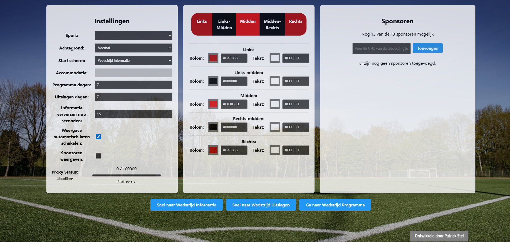
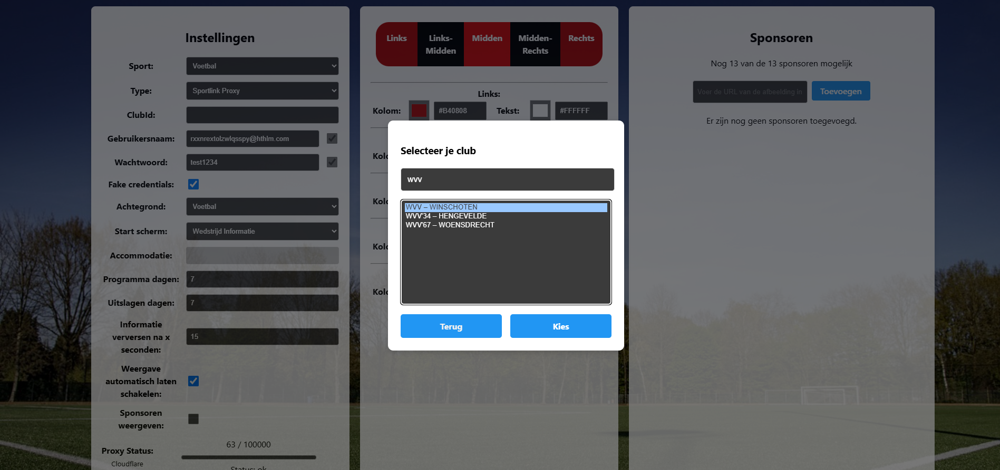
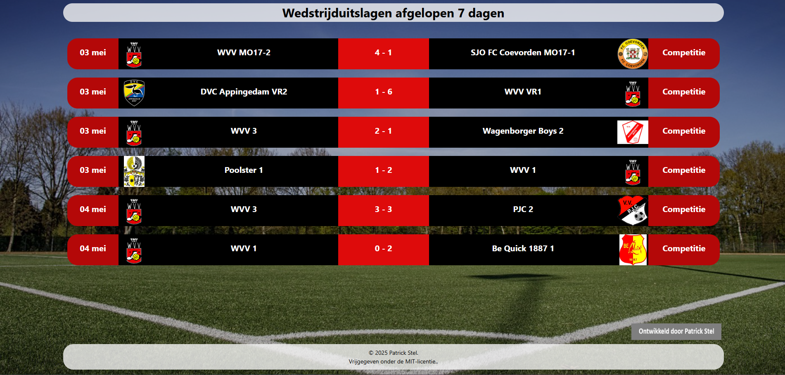
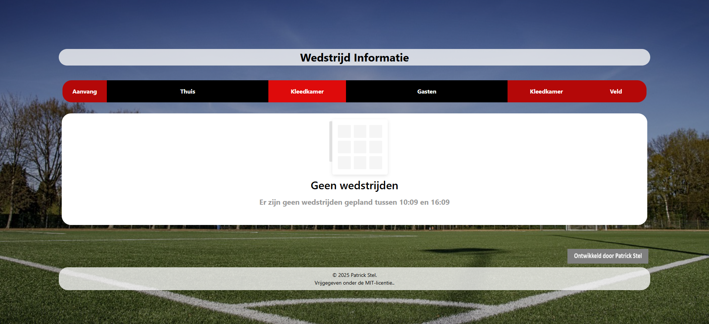

# 🖼️ Voorbeelden – ClubInfoBoard

Op deze pagina krijg je een visuele indruk van de verschillende schermen die beschikbaar zijn in **ClubInfoBoard**.  
Gebruik dit als referentie bij het instellen van je eigen weergave via de [instellingenpagina](./settings.md).

---

## ⚙️ Instellingen

Hier configureer je onder andere sport, type verbinding, weergave-instellingen, styling en sponsors.

__Club zoeken via Sportlink Proxy__
---

## 🗓️ Programmaweergave

Toont de komende wedstrijden met tijd, teams, locatie en eventueel veld- of kleedkamerindeling.

---

## ✅ Uitslagenweergave

Toont de recente wedstrijdresultaten van de vereniging.

---

## 🧾 Wedstrijdinformatie

Toont informatie over de wedstrijden die binnenkort starten, inclusief kleedkamer- en veldindeling.  
📷 *Afbeelding volgt binnenkort…*

Wedstrijd informatie beschikbaar

Wedstrijd informatie beschikbaar

---

## 📢 Zelf een voorbeeld insturen?

Heb je een opstelling of verbeterde layout die je graag als voorbeeld wilt delen?  
[Open dan een issue op GitHub](https://github.com/PatrickSt1991/Sportlink.Club.Info.Viewer/issues) of dien een pull request in!

---

## 🔐 Beveiligingsmeldingen

Heb je een kwetsbaarheid ontdekt?  
Meld deze dan verantwoord via het [Security Policy-formulier](https://github.com/PatrickSt1991/Sportlink.Club.Info.Viewer/security/policy).
